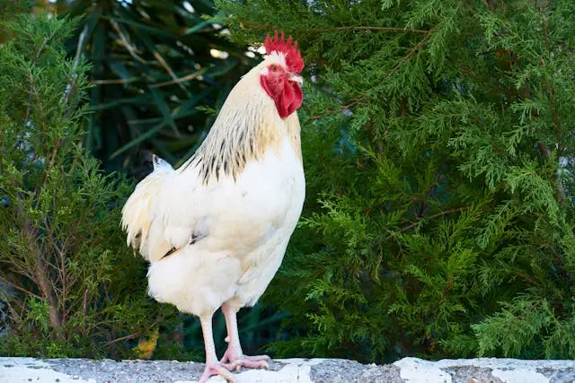
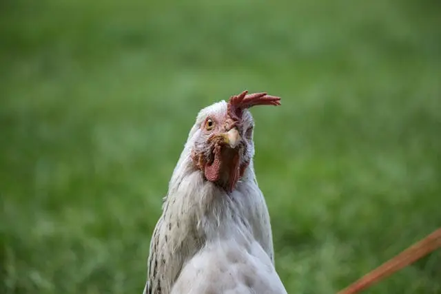

# CamRaff - Milestone Project 2 - Craffty's Farm

Here is a link to the deployed site: [Craffty's Farm](https://camraff.github.io/Crafftys-Farm_MP2/ "Craffty's Farm")

For my second MilestoneProject on my course through Code Institute via UCP (University Centre Peterborough), I thought it would be fun to produce a site which had the opportunity to be used in an educational way, with a scope to make it usable for parents and teachers to make learning fun for their children. The idea was to make it fun and informative, while also keeping it relatively basic so that children would be able to navigate it themselves.

# Contents

- [User Experience](#user-experience-ux)

    - [User Stories](#user-stories)

- [Design and Development](#design-and-development)

    - [Wireframes](#wireframes)
        
        - [Desktop](#desktop)

        - [Mobile](#mobile)

    - [Images](#images)

        - [Background](#background)

        - [Game Tiles](#game-tiles)

        - [Info Pages](#info-pages)

        - [Favicons](#favicons)

    - [Fonts](#fonts)

        - [Margarine](#margarine)

        - [LXGW](#lxgw-wenkai-mono-tc)

    - [Features](#features)

        - [Home Page](#home-page)

        - [Game Page](#game-page)

        - [Animal/Info Page](#animalinformation-pages)

    - [Deployment and Local Development](#deployment-and-local-development)

        - [Deployment](#deployment)

        - [Local Development](#local-development)

            - [Fork](#fork)

            - [Clone](#clone)

- [Testing](#testing)

    - [Automated](#automated)

        - [W3 Validator](#w3-validator)

---

# User Experience (UX)

## User Stories

### First Time Visitors

- I want to find something I can use to keep my kids entertained.
- I want something that is fun, yet has the ability to teach my kids something they may not have known before.

### Returning and Frequent Users

- I want something I know is going to entertain the kids.

---

# Design and Development

## Wireframes

Below you can see the initial mock-ups for each page of the website. The ideas behind each page will be explained beneath the images.

### Desktop

This is the initial mock-up for the three different kinds of pages on the site when displayed on a wide or desktop view.

- #### Home

For this page, I wanted to keep the design simple with a main navigation bar and a footer which will be displayed the same across all pages. As this is just the home/landing page, I didn't want to flood the user with too much information. There will be a brief introduction to the site displayed in the center of the page, and a button which will take you to the interactive/game area. The button to access the interactive/game area will also be the same as one of the links in the navigation bar, for ease of access. 

- #### Game Area

This is where most of the interactivity will be encountered. This page will display something similar to a memory game, however it is not actually a game, so there will be no score or anything being counted. The purpose of finding a match is to hear the sounds of the animal which you've found the matching pair for, and to have the user then be able to access the information page available for that animal. Upon finding a match, you will see in the 2nd image that a box will appear, congratulating you and giving you the option to continue on to the information page, or return back to the interactive area. 

- #### Info Page

This is where the user will find the information page. Here, there will be images of the animal they correctly matched the pair for, and also a body of text containing the information about that animal. 

### Mobile

As I decided to keep the home page relatively basic, that will be displayed the same on mobiles and tablets (aside from the relocation of the nav bar seen below), so I have only provided images of the game area and information pages.

- #### Game Area

- #### Info Page

The mobile versions once more don't change much, it is mostly just a shift from a horizontal display to more of a vertical display.

---

## Images

Because I wanted to have this project designed so it could be used as a way to entertain kids by their parents or teachers, I decided to go with a majority cartoon-y theme. All of the images used for the game tiles were designed by AI from [Microsoft's Copilot AI](https://copilot.microsoft.com) using prompts from myself. The background was acquired from [Freepik](https://www.freepik.com), and was designed [@brgfx](https://www.freepik.com/author/brgfx).

### README Title Image

The image seen at the top of the README document was created using a website called [Am I Responsive](https://ui.dev/amiresponsive).

### Background

 

In keeping with the farm theme, I wanted something that was simple but also visually appealing, and would look nice as a background. I found this image while searching for images of empty fields and thought the addition of the fence was great, so I decided to use this as the background for the entire site.

### Game Tiles

  

 

As with the background, since I was designing this towards children, I went with very cartoon-y, almost cutesy designs.

### Info Pages

On the information pages, I decided it would be a good idea to have some realistic images of the animals as this is where the learning will occur, and though learning via cartoons is possible, I felt it would be better for them to get an actual understanding of the real life animals. I also thought it would be a good idea for them to see both sides of the animal, with one image being slightly more humorous than the other. On mobile, one of the images will be hidden, so I am going to go with the humorous photo to be displayed on smaller screens. All of the images seen below were acquired from [Pexels](https://www.pexels.com), and the individuals have been tagged under each image.

#### Chicken 

 

Left image belongs to [Engin Ukyuart](https://www.pexels.com/@enginakyurt/). Right image belongs to [Rachel Vine](https://www.pexels.com/@camerashy/).

Facts 1 and 2 were found on the website [BCSPA](https://spca.bc.ca/news/fun-facts-about-chickens/).

Fact 3 was found on the website [The Humane League](https://thehumaneleague.org.uk/article/10-facts-about-chickens-you-may-not-know?gad_source=1&gclid=EAIaIQobChMI9IaXwYDFhwMVmnR_AB0fLC0jEAAYASAAEgKMOfD_BwE).

#### Cow

 

Left image belongs to [Julie Aagaard](https://www.pexels.com/@julieaagaard/). Right image belongs to [Tobi](https://www.pexels.com/@pripicart/).

Facts 1 and 2 were found on the website [The Humane League](https://thehumaneleague.org.uk/article/10-facts-about-cows-that-you-might-not-know?gad_source=1&gclid=EAIaIQobChMIl5b34OrEhwMVKqhoCR0hNhc-EAAYAiAAEgKgVvD_BwE).

Fact 3 was found on the website [BBC](https://www.bbc.co.uk/programmes/articles/cfKXgwHG4YqR7DfGBW6GsQ/nine-udderly-fascinating-facts-about-cows).

#### Pig

 

Left image belongs to [Brett Sayles](https://www.pexels.com/@brett-sayles/). Right image belongs to [Barbara Barbosa](https://www.pexels.com/@barbara-barbosa-2859157/).

Facts 1 and 2 were found on the website [Animal Equality](https://animalequality.org.uk/blog/2021/03/10/five-extraordinary-facts-about-pigs/?gad_source=1&gclid=EAIaIQobChMI-MrauYjFhwMVBnR_AB2AqDVzEAAYASAAEgJUY_D_BwE).

Fact 3 was found on the website [Peta](https://www.peta.org.uk/blog/10-things-you-never-knew-about-pigs-with-photos/?utm_source=PETA%20UK::Google&utm_medium=Ad&utm_campaign=1120::gen::PETA%20UK::Google::s-grant-awa-dsa::::searchad&gad_source=1&gclid=EAIaIQobChMI-MrauYjFhwMVBnR_AB2AqDVzEAAYAiAAEgI8xvD_BwE).

### Favicons

The browser tab image used in this site were acquired using the [Favicon](https://favicon.io/favicon-converter/). 

---

## Colour Scheme

I chose lighter colours for the website, opting for blue (#rgba(0, 150, 255, .7)) as the background for divs, navigation and footer to provide a contrast between that and the white (#white) text while also maintaining the visibility of the background behind it. I used a green (#rgb(94, 244, 114)) for highlights on hover and buttons. All of these colors were chosen as they were shades of the background, meaning the colour scheme was able to be maintained throughout and it matched the background on all pages.

---

## Fonts

For the font on the site, I decided to go with something that was quite rounded on the edges and soft on the eyes, as it is designed for children. I didn't want the ltters and words to be too sharp. I got this idea when doing a bit of research on childrens sites and I came across the [Peppa Pig](https://www.peppapig.com/en-us) website. 

After taking a look at the fonts available on [Google Fonts](https://fonts.google.com), I decided upon two different fonts, one to be used for headers and in the navigation bar, and one for body text. 

### Margarine

I chose the font [Margarine](https://fonts.google.com/specimen/Margarine?preview.text=Welcome%20to%20Craffys%20Farm&preview.layout=grid) for the headers and navigation bars as it is very soft but also stands out very well.

### LXGW WenKai Mono TC

I chose the font [LXGW WenKai Mono TC](https://fonts.google.com/specimen/LXGW+WenKai+Mono+TC?preview.text=Welcome%20to%20Craffys%20Farm&preview.layout=grid) for the body text as it is a bit easier to read over long periods than Margarine, yet it still has a soft and rounded feel.

---

## Features

The project I have created for Milestone Project 2 consists of 5 pages in total, the home page, the game page, and 3 animal/information pages.

- #### Home Page

The home page is kept very simple, with a navigation bar at the top with a logo serving as a link back to the home page, a home link and a link to the game. There is an introduction to the site in the main body, as well as another link to the farm, prompting users to "begin your search". There is also a footer consisting of copyright information and a link to the GitHub repository. 

- #### Game Page

The game page features the same navigation bar and footer as the home page, but differs as it features a tile flipping memory game, where the user must match 2 cards in order to progress to the animal/information pages. This page features a 3x2 grid of flippable cards on desktop screens which converts to a 2x3 grid on smaller screens. 

 

The tiles feature a barn as the outter and then when flipped you can see the animal card, as shown below:

 

Flipping 2 of the same tiles brings up the win popup, giving you the option to proceed to the information page for the animal you've correctly matched, or to return to the farm and continue matching pairs: 

- #### Animal/Information Pages

The animal/information pages are very straight forward and maintains the navigation bar from the game and home pages, with added information in the footer. On these pages there is an image, a text box with a scroll bar and another image horizontally on the page with a button to return to the farm below. This page transforms vertically on smaller screens and removes one of the images to make it a bit more pleasant for the user. As all 3 of the animal pages follow the same structure, I've only displayed one of them below.

## Development

For this project, as per the requirements, the languages I used to create this website were HTML, CSS and Javascript. 

### Libraries, Websites and Programs 

- I used [VSCode](https://code.visualstudio.com) as my IDE of choice. 
- I used [Git](https://git-scm.com/) for version control.
- I used [GitHub](https://github.com/) to commit and store all files relating to the project.
- I used [Balsamiq](https://balsamiq.com/) to produce the above wireframes.
- I used [Favicon](https://favicon.io/) to produce the favicon used in the title.
- I used [Google Fonts](https://fonts.google.com/) to evaluate and decide which fonts to use throughout the website.
- I used [Font Awesome](https://fontawesome.com/) to acquire the icons used for the GitHub icon in the footer.
- I used [Google Dev Tools](https://developer.chrome.com/docs/) as a means of testing the website throughout its production.

---

## Deployment and Local Development

### Deployment

This site is available for deployment via GitHub Pages. In order to deploy this site, you must:

1. Log in to Github (or sign up).
2. Go to the repository for this project - <https://github.com/CamRaff/Crafftys-Farm_MP2>
3. Click the "Settings" button above the project name.
4. Select "Pages" from the navigation bar at the left of the screen.
5. From the source dropdown, select "Deploy from a branch", and then "main".
6. The site is now deployed. This may take a few moments, but upon completion you should be able to acquire the link and visit the site via the top of GitHub Pages.

### Local Development

#### Fork

In order to Fork this repository, you must:

1. Log in to GitHub (or sign up).
2. Go to the repository for this project - <https://github.com/CamRaff/Crafftys-Farm_MP2>
3. Click the "Fork" button on the right, on the same line as the project name.

#### Clone

In order to clone this repository, you must:

1. Log in to GitHub (or sign up).
2. Go to the repository for this project - <https://github.com/CamRaff/Crafftys-Farm_MP2>
3. Click on the "Code" button above the number of commits. 
4. Select whether you would like to clone with HTTPS, SSH or GitHub CLI, then copy the given link.
5. Open the terminal in your desired IDE, then select your desired location for the cloned directory.
6. Type 'git clone' into the terminal, paste the link you copied in step 4 and press enter.

---

# Testing

## Automated

### W3 Validator - HTML

In order to conduct testing on the HTML of my website, I used the [W3C Validator](https://validator.w3.org/). The results for the testing of all of the HTML documents are below.

- #### Home

